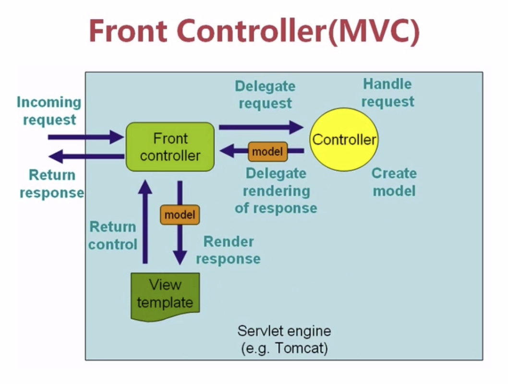
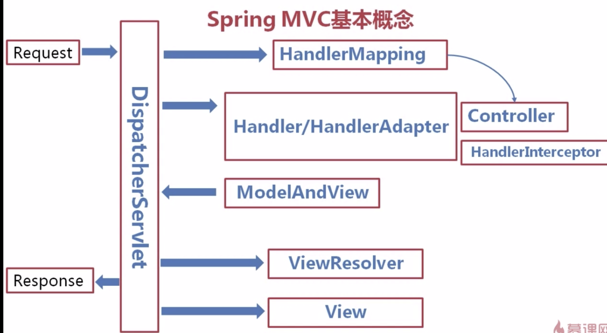
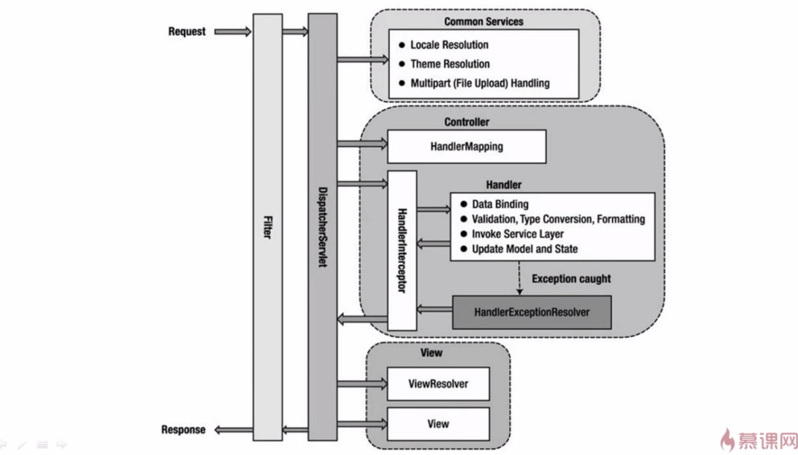

 # Spring MVC

 ### 使用Maven 创建使用Maven 管理的 java web 项目

 ```
 mvn archetype:generate -DgroupId=itanken-arthur -DartifactId=spring-mvc-study -DarchetypeArtifactId=maven-archetype-webapp
 ```
 也可以创建Maven项目选择archetype-webapp;

 ### <properties>

 使用 <properties> 可以统一管理版本信息

 ### <dependencyManagement> 管理依赖版本

 ```
        <dependencyManagement>
            <dependencies>
                <!--依赖管理: 如果A依赖了Z 1.0 ,而B依赖了Z 2.0 ;为了管理这种依赖问题出现了dependencyManagement;
                 可以指定AB 依赖的Z的版本-->
                <!-- https://mvnrepository.com/artifact/org.springframework/spring-framework-bom -->
                <dependency>
                    <groupId>org.springframework</groupId>
                    <artifactId>spring-framework-bom</artifactId>
                    <version>${spring.version}</version>
                    <type>pom</type>
                    <scope>import</scope>
                </dependency>

            </dependencies>
        </dependencyManagement>

 ```

 ### 配置Tomcat运行环境

 ```
  <!--如果是Tomcat启动 则需要下面三个依赖 -->
         <!-- https://mvnrepository.com/artifact/javax.servlet/jstl -->
         <dependency>
             <groupId>javax.servlet</groupId>
             <artifactId>jstl</artifactId>
             <version>1.2</version>
         </dependency>

         <!-- https://mvnrepository.com/artifact/javax.servlet/jsp-api -->
         <dependency>
             <groupId>javax.servlet</groupId>
             <artifactId>jsp-api</artifactId>
             <version>2.0</version>
             <scope>provided</scope>
         </dependency>

         <!-- https://mvnrepository.com/artifact/org.apache.tomcat/tomcat-servlet-api -->
         <dependency>
             <groupId>org.apache.tomcat</groupId>
             <artifactId>tomcat-servlet-api</artifactId>
             <version>8.5.39</version>
         </dependency>

 ```

 ### 配置Jetty 插件. 通过 mvn jetty:run 部署

 ```
  <plugins>
             <plugin>
                 <!--IDEA 上好像用不了这个插件-->
                 <!--   <groupId>org.eclipse.jetty</groupId>
                    <artifactId>jetty-server</artifactId>
                    <version>9.2.2.v20140723</version>-->

                 <groupId>org.mortbay.jetty</groupId>
                 <artifactId>jetty-maven-plugin</artifactId>
                 <configuration>
                     <!-- 设置扫描target/classes内部文件变化时间间隔 -->
                     <scanIntervalSeconds>5</scanIntervalSeconds>
                     <webApp>
                         <contextPath>/</contextPath>
                     </webApp>
                 </configuration>
             </plugin>
         </plugins>

 ```
 
 ### Spring mvc 基本概念
  <div align="center">
  
  
  
  </div>

 


