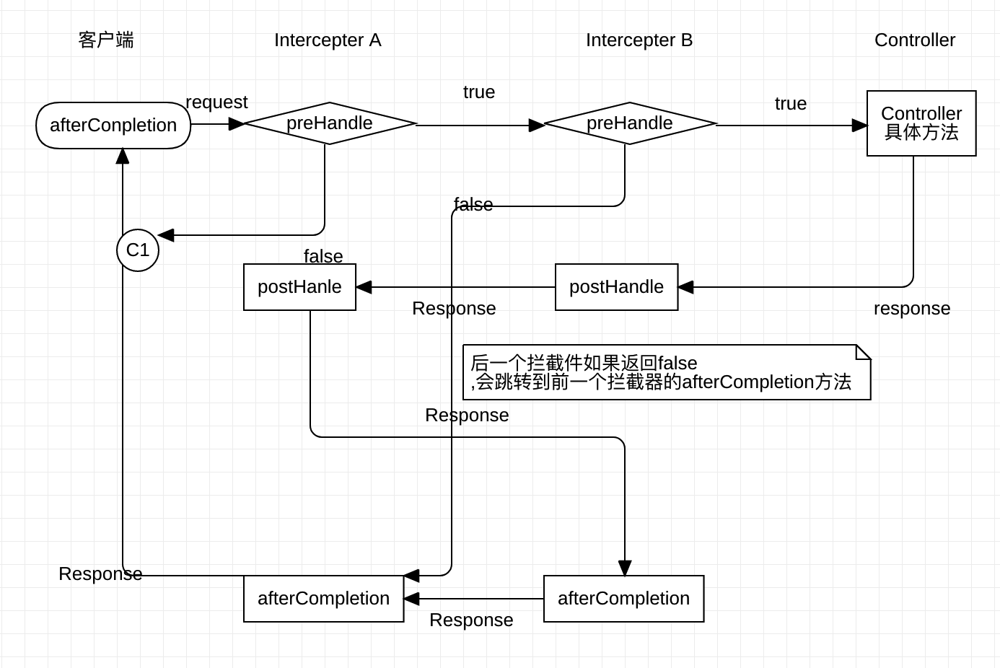

 # Spring MVC

 ### 使用Maven 创建使用Maven 管理的 java web 项目

 ```
 mvn archetype:generate -DgroupId=itanken-arthur -DartifactId=spring-mvc-study -DarchetypeArtifactId=maven-archetype-webapp
 ```
 也可以创建Maven项目选择archetype-webapp;

 ### <properties>

 使用 <properties> 可以统一管理版本信息

 ### <dependencyManagement> 管理依赖版本

 ```
        <dependencyManagement>
            <dependencies>
                <!--依赖管理: 如果A依赖了Z 1.0 ,而B依赖了Z 2.0 ;为了管理这种依赖问题出现了dependencyManagement;
                 可以指定AB 依赖的Z的版本-->
                <!-- https://mvnrepository.com/artifact/org.springframework/spring-framework-bom -->
                <dependency>
                    <groupId>org.springframework</groupId>
                    <artifactId>spring-framework-bom</artifactId>
                    <version>${spring.version}</version>
                    <type>pom</type>
                    <scope>import</scope>
                </dependency>

            </dependencies>
        </dependencyManagement>

 ```

 ### 配置Tomcat运行环境

 ```
  <!--如果是Tomcat启动 则需要下面三个依赖 -->
         <!-- https://mvnrepository.com/artifact/javax.servlet/jstl -->
         <dependency>
             <groupId>javax.servlet</groupId>
             <artifactId>jstl</artifactId>
             <version>1.2</version>
         </dependency>

         <!-- https://mvnrepository.com/artifact/javax.servlet/jsp-api -->
         <dependency>
             <groupId>javax.servlet</groupId>
             <artifactId>jsp-api</artifactId>
             <version>2.0</version>
             <scope>provided</scope>
         </dependency>

         <!-- https://mvnrepository.com/artifact/org.apache.tomcat/tomcat-servlet-api -->
         <dependency>
             <groupId>org.apache.tomcat</groupId>
             <artifactId>tomcat-servlet-api</artifactId>
             <version>8.5.39</version>
         </dependency>

 ```

 ### 配置Jetty 插件. 通过 mvn jetty:run 部署

 ```
  <plugins>
             <plugin>
                 <!--IDEA 上好像用不了这个插件-->
                 <!--   <groupId>org.eclipse.jetty</groupId>
                    <artifactId>jetty-server</artifactId>
                    <version>9.2.2.v20140723</version>-->

                 <groupId>org.mortbay.jetty</groupId>
                 <artifactId>jetty-maven-plugin</artifactId>
                 <configuration>
                     <!-- 设置扫描target/classes内部文件变化时间间隔 -->
                     <scanIntervalSeconds>5</scanIntervalSeconds>
                     <webApp>
                         <contextPath>/</contextPath>
                     </webApp>
                 </configuration>
             </plugin>
         </plugins>

 ```
 
 ### Spring mvc 基本概念
  <div align="center">
  
  
  
  </div>
  
  
 ###  Spring mvc 配置信息
 
  1: 使用web-app_2_4.xsd版本 2_3标准 页面默认将el表达式关闭
  
  ```$xslt
  如果配置了 2.4标准就不需要在jsp 中手动开启
 <%@ page isELIgnored="false" %>
```

  2: 层次化的ApplicationContext
    ContextLoaderListener 加载 Spring 容器ApplicationContext, 扫描项目中的@Component, @Service 等
    DispatcherServlet 加载管理 @Controller
    
    
  3:Controller : @Controller  @RequestMapping(一般作用在类和方法上)
    请求 由DispatcherServlet 分发给 Controller类;Controller根据业务需求,返回(可以是Json ,可以是 ModelAndView)  
      
      1:获取请求参数 :
                1:针对/courses/view?courseId=111的这种参数获取 , 使用 @RequestParam("参数字段") Integer courseId;
                2:针对/courses/view2/courseId , 使用@PathVariable("courseId") Integer courseId ;
                
                
      2:将数据添加到Model , SpringMVC 中数据有三种形式
                1:model.addAttribute(object)
                2:Map<String,Object>
                
      3:更加DispatcherServlet 中配置的 ViewResolver 返回
      
      

 

  4: Binding 
        
        可以使用 @ModelAttribute 实现模型和JSP页面模型数据绑定
        可以使用 redirect:xxx 实现重定向
                forward: xxx 实现请求转发
                
  5: annotation 总结 
  
        @Controller @RequestMapping 
        @RequestParam @PathVariable
        @ModelAttribute
                      
                
 ###  Spring mvc 文件上传
    
    1:Post请求 ; 需要配置 enctype="multipart/form-data"    
    2:引入 commons-fileupload 依赖
    3:并给DispatcherServlet配置CommonsMultipartResolver,注意需要设置id="multipartResolver" 
    设置原理给DispatcherServlet multipartResolver 提供初始化参数;
    4:服务器使用@RequestParams("file对应的字段")标记 MultipartFile 字段参数;
    5:使用Commands-io 中的工具方法 保存文件;
    
    
  ###  Spring mvc Json
    
    0:需要引入jackson-databind依赖
    1:配置DispatcherServlet,添加ContextNegotiatingViewResolver,其中配置default MappingJackson2JsonView,配置mediatype等
    2:Controller中 两种方法处理
        1: 返回参数类型前 使用 @ResponseBody 标注返回参数;
        2: 使用ResponseEntity类的实例装饰要放回的对象的实例;
        
 ```
 
  <!---->
     <bean class="org.springframework.web.servlet.view.ContentNegotiatingViewResolver">
 
         <property name="order" value="1"/>
         <property name="mediaTypes">
             <map>
                 <entry key="json" value="application/json"/>
                 <entry key="xml" value="application/xml"/>
                 <entry key="htm" value="text/htm"/>
             </map>
         </property>
 
         <property name="defaultViews" >
             <list>
                 <bean class="org.springframework.web.servlet.view.json.MappingJackson2JsonView"/>
             </list>
         </property>
 
         <property name="ignoreAcceptHeader" value="true"/>
 
     </bean>
 
 
 /**
      * 使用 @ResponseBody 注解标注返回类型 可以直接放对象转为Json
      *
      * @param courseId
      * @return
      */
     @RequestMapping(value = "/json/{courseId}", method = RequestMethod.GET)
     public @ResponseBody
     Course getJson(@PathVariable("courseId") Integer courseId) {
         Course course = courseService.getCoursebyId(courseId);
         return course;
     }
 
     /**
      * 使用  ResponseEntity对象实例包装要返回对象的实例 可以直接放对象转为Json
      *
      * @param courseId
      * @return
      */
     @RequestMapping(value = "/json1/{courseId}", method = RequestMethod.GET)
     public ResponseEntity<Course> getJson1(@PathVariable("courseId") Integer courseId) {
         Course course = courseService.getCoursebyId(courseId);
         return new ResponseEntity<Course>(course, HttpStatus.OK);
     }


```   

  ### DispatcherServlet 配置的原理
  
    1:在web.xml中配置了,DispatcherServlet初始化时传入一个ApplicationContext;
    2:被传入的ApplicationContext 是一个容器,注入了很多的Bean实例;
    3:给DispatcherServlet 使用的 Application容器只扫描被@Controller注解的类;
    4:其中 注入 ViewResolver 和 Resolver 的原理:  
      
        ViewResolver: DispatcherServlet 会执行 initViewResolvers(context); 
                      其中会得到一个Map集合,这个map 集合就是ViewResolver的集合,
                      这个Map 是 ApplicationContext 容器提供的一个特性;
                      容器会把同类型的参数,整合为一个集合,或者数组; 所以ViewResolver不需要使用id;
        
        Resolver: 这里以文件上传的multipartResolver 为例;
                DispatcherServlet 会执行 initMultipartResolver(context); 
                其中就是使用ApplicationContext 容器获取 名称为"multipartResolver"的实例;
                这个名称就是id,所以这个id写错,或者不写就会报错;
                public static final String MULTIPART_RESOLVER_BEAN_NAME = "multipartResolver";
                
    
  
 # Spring filter and intercepter
 
   ### Spring filter 
        
        1:Spring 提供了莫非的Filter,CharacterEncodingFilter 
        2:web.xml 中配置filter ,并配置init-param ;根据CharacterEncodingFilter 源码查看对应的param-name
        3: intellij IDEA 配合 tomcat 控制台打印中文出现?? 问题;在配置项VM options文本框中输入-Dfile.encoding=UTF-8
        https://blog.csdn.net/liu865033503/article/details/81094575
        
        
   ```$xslt
 <filter>
        <filter-name>encodingFilter</filter-name>
        <filter-class>org.springframework.web.filter.CharacterEncodingFilter</filter-class>
        <init-param>
            <param-name>encoding</param-name>
            <param-value>utf-8</param-value>
        </init-param>
        <init-param>
            <param-name>forceEncoding</param-name>
            <param-value>true</param-value>
        </init-param>
    </filter>

    <filter-mapping>
        <filter-name>encodingFilter</filter-name>
        <url-pattern>*</url-pattern>
    </filter-mapping>
```     
        
   ### Sping intercepter  
   
        实现SpringMVC intercepter 的两种方式;
        1:实现HandlerInterceptor 接口
        2:实现WebRequestInterceptor 接口 ,没有返回参数的preHandle方法,不能终止请求;
        3:两种实现拦截器的方式 都需要想SpringMVC 容器注册;
        
   ```
/**
     * 最先执行 NO.1
     * <p>
     * 这个方法中判断是否拦截  返回true 说明不拦截  返回false 拦截,请求终止

     * @param handler  handler 可以获取到 Controller的实例
     */
    public boolean preHandle(HttpServletRequest request, HttpServletResponse response, Object handler) throws Exception {
        System.out.println("preHandle   :  " + handler.toString());
        System.out.println("preHandle 1  :  " + handler);
        if (!StringUtils.isEmpty(encoding)) {
            request.setCharacterEncoding(encoding);
            response.setCharacterEncoding(encoding);
        }
        return true;
    }

    /**
     * NO.2  执行到这一步 请求已经到达Controller 并要返回给请求端
     * @param modelAndView Controller 返回的modelAndView ,通过操作modelAndView 可以修改数据和视图;
     */
    public void postHandle(HttpServletRequest request, HttpServletResponse response, Object handler, ModelAndView modelAndView) throws Exception {

    }

    /**
     * NO.3 执行到这一步 请求已经响应完成后, 用来最终释放资源;
     */
    public void afterCompletion(HttpServletRequest request, HttpServletResponse response, Object handler, Exception ex) throws Exception {
        System.out.println("afterCompletion1   :  " + handler.toString());
    }
```     

    多拦截器的情况
    
    1: 多拦截器执行的顺序按照 xml.中配置的顺序执行.
    2: 执行顺序可以理解为 收费站的例子.
    
    
   <div align="center">
      
    </div>
        
        
        
       